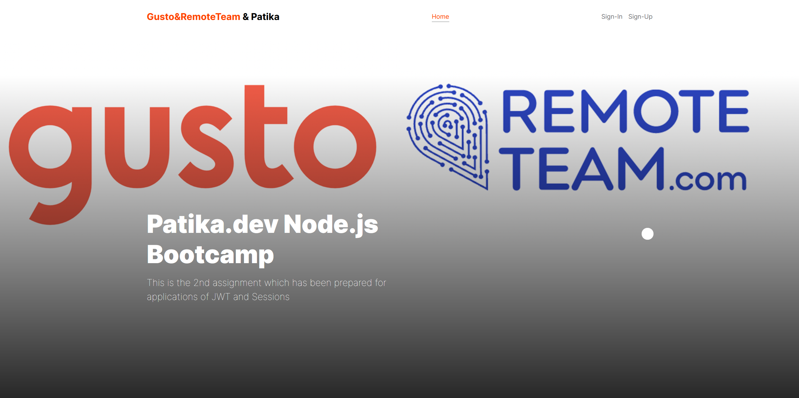
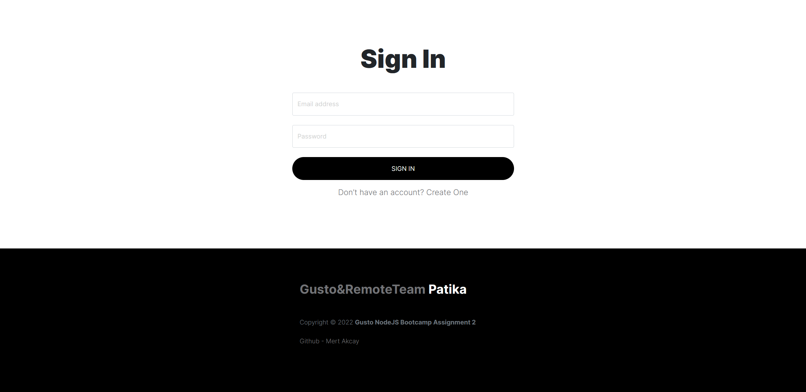
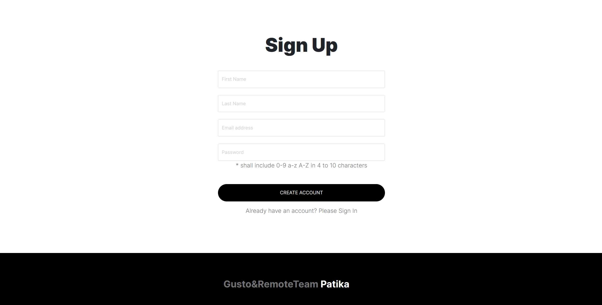

# Gusto&RemoteTeam Bootcamp Assignment-2
### This assignment has been prepared for applications of JSON Web Tokens and Sessions
### 4 page is included to this assignment
- Homepage
- Sign-up Page
- Sign-in Page
- Users Page
### In every login, user's ID and browser info is stored in session and a JWT Token. This token and session ID returns to the client with cookies. 
### After this process, every authentication-required operation can be done after comparison of browser infos and userIDs in Session, JWT and Request(cookies) 

 

## [Here is a live demo](https://gusto-remoteteam-week2.herokuapp.com/) 
 

## Home Page

## Sign-up Page

## Sign-in Page

## Users Page
